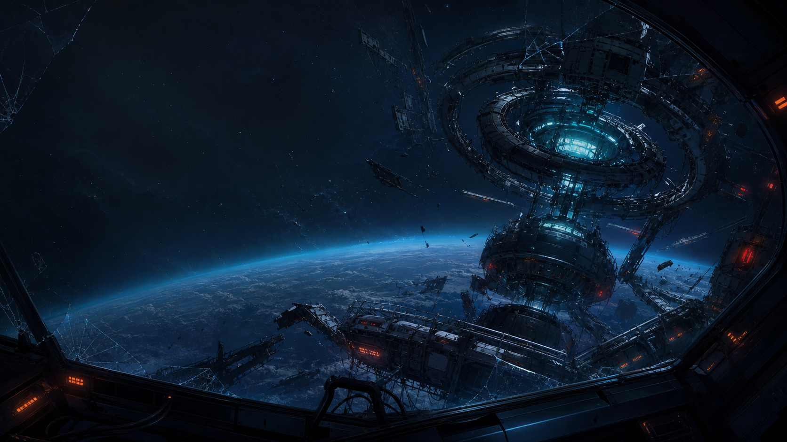

# 故障宇宙站

《故障宇宙站》是一款原创 Windows 单机卡牌冒险游戏。

你将在失控的赫利俄斯空间站中选择航线、执行战斗指令、改造牌组并回收遗物，逐层接近已经失谐的空间站核心。

游戏完全离线运行，不需要账号、网络连接或云服务器。

## 游戏内容

- 4 种初始观测单元，每种都有不同的初始牌组和遗物。
- 均衡、过热爆发、护盾构筑、锁定连锁等不同战斗流派。
- 41 张原创卡牌，可在航程中获取、升级或删除。
- 11 类敌人，包括普通异常体、精英核心和环区 Boss。
- 三层分支航线，包含战斗、未知事件、维修舱和回收商店。
- 8 件遗物与 8 个随机事件。
- 卡牌升级前后预览，以及战斗中的预计伤害和护盾提示。
- 本地自动存档、新手教学、背景音乐和游戏音效。

## 下载与运行

1. 打开右侧的 **Releases**。
2. 下载最新的 `station-zero-vX.X.X-windows-x64.zip`。
3. 将 ZIP 完整解压到一个文件夹。
4. 双击解压目录中的 `故障宇宙站.exe`。

请不要只把 EXE 单独复制出来运行。当前发布的是解包版，EXE 需要与旁边的 `resources`、DLL 等运行文件放在同一个目录中。

## 系统要求

- Windows 10 或 Windows 11
- 64 位系统
- 建议预留约 350 MB 磁盘空间

如果 Windows SmartScreen 显示“未知发布者”，这是因为当前版本没有购买商业代码签名证书，并不代表文件包含恶意程序。

## 存档

游戏进度自动保存在当前 Windows 用户的本地应用数据目录中。删除游戏文件不会自动删除存档。

## 源码说明

此公开仓库只用于提供游戏下载和版本说明，不包含游戏源码。GitHub Release 自动显示的 `Source code` 压缩包中也只有本下载仓库的说明文件。
